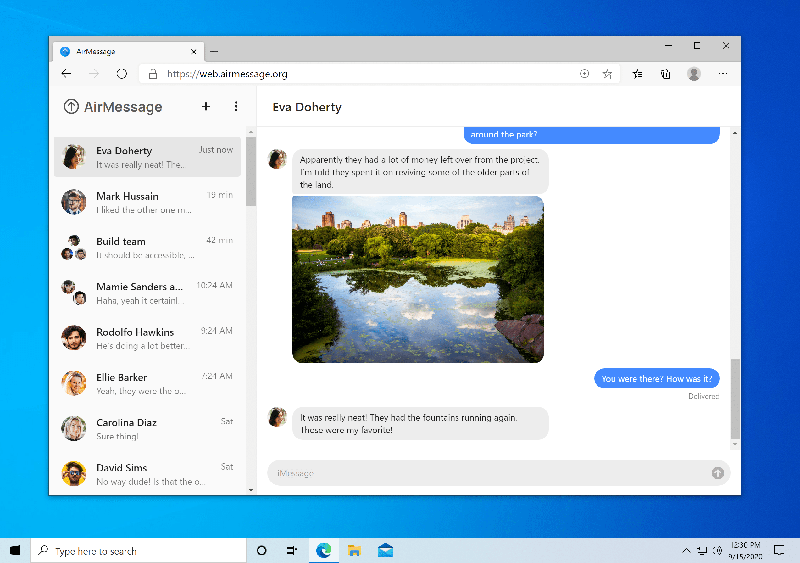

# AirMessage for web

AirMessage lets people use iMessage on the devices they like.
**AirMessage for web** brings iMessage to modern web browsers over a WebSocket proxy.
Production builds are hosted on [web.airmessage.org](https://web.airmessage.org).

Other AirMessage repositories:
[Server](https://github.com/airmessage/airmessage-server) |
[Android](https://github.com/airmessage/airmessage-android) |
[Connect (community)](https://github.com/airmessage/airmessage-connect-java)

## Getting started

To build AirMessage for web, you will need [Node.js](https://nodejs.org).

AirMessage for web uses [React](https://reactjs.org) and [TypeScript](https://www.typescriptlang.org). If you're not familiar with these tools, they both have great introductory guides:
- [React - Getting started](https://reactjs.org/docs/getting-started.html)
- [TypeScript for JavaScript Programmers](https://www.typescriptlang.org/docs/handbook/typescript-in-5-minutes.html)

AirMessage for web uses a configuration file to associate with online services like Firebase and Sentry.
The app will not build without a valid configuration, so to get started quickly, you can copy the `src/secrets.default.ts` file to `src/secrets.ts` to use a pre-configured Firebase project, or you may provide your own Firebase configuration file.

To launch a development server, run `npm start`. To build a production-optimized bundle, run `npm run build`.

## File structure outline

- `/public` holds static files that are copied in at build time. It also holds the app's entry point, `index.html`.
- `/src` holds shared source files - where most of the UI logic resides.
- `/browser` holds all browser-specific code. This includes logic for authenticating with Firebase and using AirMessage's WebSocket proxy.
- `/windows/web` holds all web-side Windows-specific code.
- `/windows/AirMessageWindows` is a Visual Studio project that builds to AirMessage's Windows client.
- Builds are located in `/build` for web builds.

`/browser` and `/windows/web` are aliased to the import prefix `/platform-components` at build time, depending on the build target.
As such, components that are imported from `/src` must be available in both directories. If you're adding or modifying any files in these build-specific directories, please ensure that they are imported properly with the `/platform-components` alias.

Any extra files under build-specific directories (`/browser` or `/windows/web`) that aren't used by `/src` should be under a `private` subdirectory.

## Building and running for AirMessage Connect

In order to help developers get started quickly, we host a separate open-source version of AirMessage Connect at `connect-open.airmessage.org`.
The default configuration is pre-configured to authenticate and connect to this server.
Since this version of AirMessage Connect is hosted in a separate environment from official servers, you will have to be running a version of AirMessage Server that also connects to the same AirMessage Connect server.

We kindly ask that you do not use AirMessage's official Connect servers with any unofficial builds of AirMessage-compatible software.

## Developing and running Windows builds

AirMessage is also able to run on Windows machines, with support for direct connections like the Android app.

Builds for web browsers and Windows will be kept in sync, so any changes made to files under the `/src` directory will make their way into the web app as well.

On top of the dependencies for AirMessage for web, AirMessage for Windows uses
[Visual Studio](https://visualstudio.microsoft.com/),
the [Windows App SDK](https://docs.microsoft.com/en-us/windows/apps/windows-app-sdk/),
and [Microsoft Edge WebView2](https://developer.microsoft.com/en-us/microsoft-edge/webview2/).

To build and run, please make sure you have installed
[Visual Studio](https://visualstudio.microsoft.com/downloads/),
[prepared your PC for Windows app development](https://docs.microsoft.com/en-us/windows/apps/windows-app-sdk/set-up-your-development-environment),
and installed [Microsoft Edge WebView2](https://go.microsoft.com/fwlink/p/?LinkId=2124703).

Then, open the project in Visual Studio at `/windows/AirMessageWindows/AirMessageWindows.sln`, and run **AirMessageWindows (Package)**.

---

Thank you for your interest in contributing to AirMessage!
You're helping to shape the future of an open, secure messaging market.
Should you have any questions, comments, or concerns, please shoot an email to [hello@airmessage.org](mailto:hello@airmessage.org).
